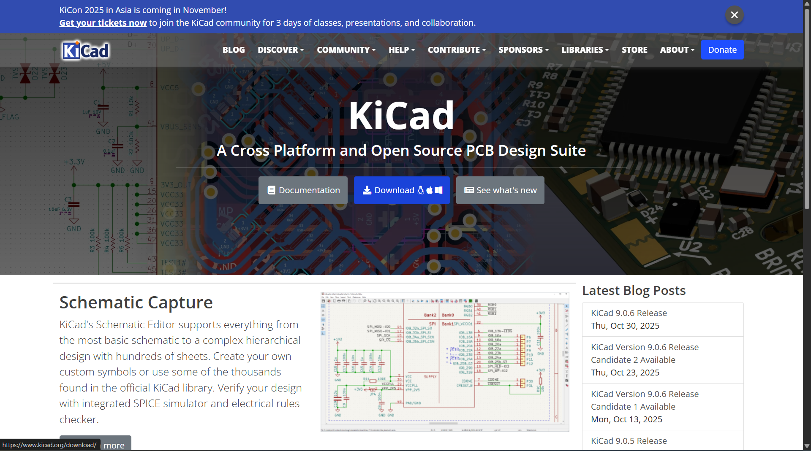
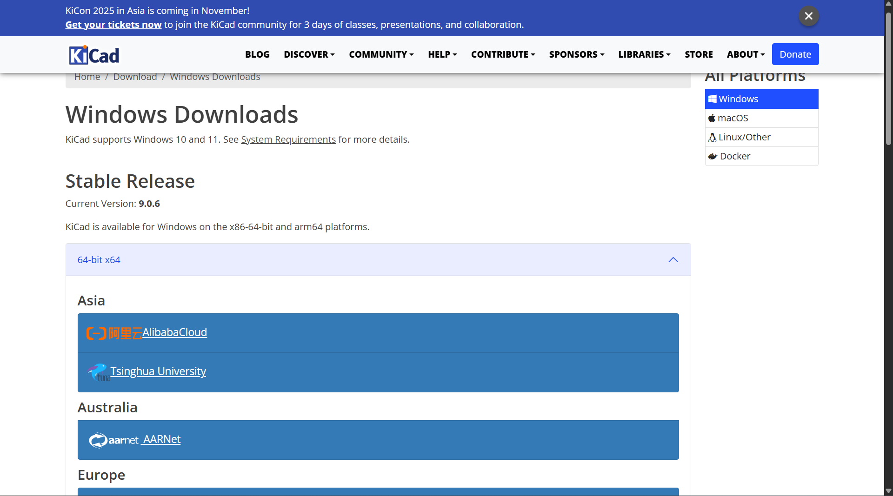
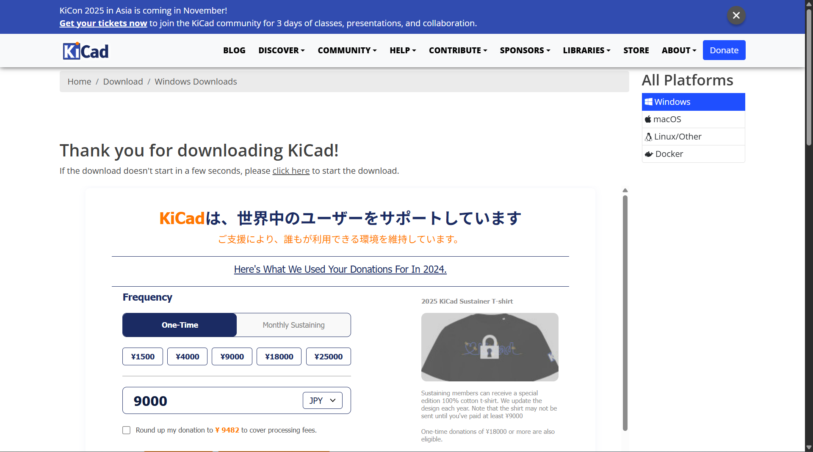
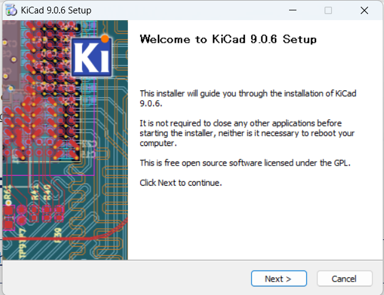
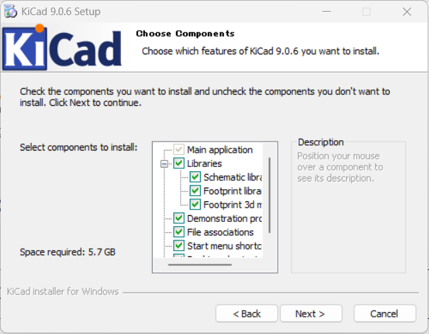
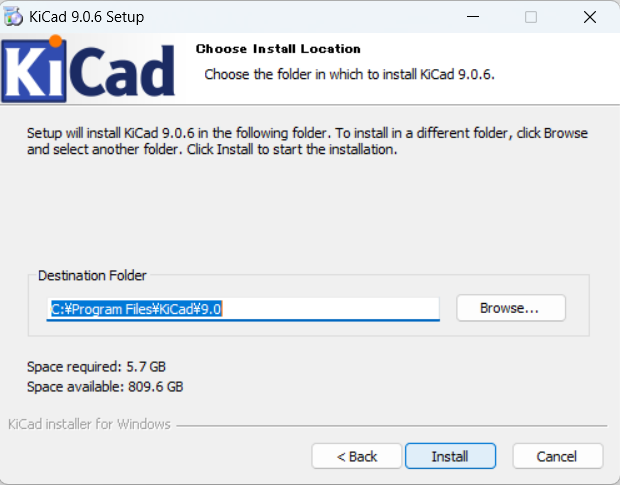
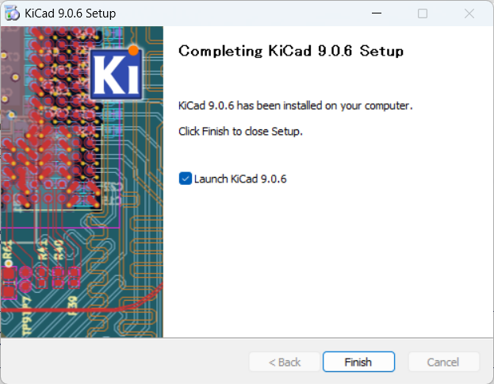

# KiCad インストールガイド

**作成日**: 2025-11-12
**対象者**: KiCad初心者
**所要時間**: 約30分
**難易度**: ★☆☆☆☆

---

## 📋 目次

1. [KiCadとは](#kicadとは)
2. [システム要件](#システム要件)
3. [ダウンロード](#ダウンロード)
4. [インストール手順](#インストール手順)
5. [初回起動と確認](#初回起動と確認)
6. [日本語化](#日本語化)
7. [ライブラリの設定](#ライブラリの設定)
8. [トラブルシューティング](#トラブルシューティング)

---

## 1️⃣ KiCadとは

**KiCad** は、プロフェッショナル品質のPCB（プリント基板）を設計できる、完全無料のオープンソースソフトウェアです。

### 主な特徴

| 特徴 | 説明 |
|------|------|
| **完全無料** | 機能制限なし、商用利用も可能 |
| **オープンソース** | GPLv3+ライセンス |
| **クロスプラットフォーム** | Windows, Mac, Linux対応 |
| **統合環境** | 回路図からPCBまで一貫して設計 |
| **プロ品質** | 最大32層基板、差動ペア対応 |

### KiCadでできること

```
回路図作成
    ↓
電気的ルールチェック（ERC）
    ↓
PCBレイアウト
    ↓
デザインルールチェック（DRC）
    ↓
3Dプレビュー
    ↓
製造データ（ガーバー）生成
```

---

## 2️⃣ システム要件

**最新版**: KiCad 9.0.6（2025年11月時点）

| 項目 | 要件 |
|------|------|
| **OS** | Windows 10 64-bit 以降 / Windows 11 |
| **プロセッサ** | x64プロセッサ（推奨: Intel Core i5以上） |
| **メモリ** | 8GB以上推奨（最小4GB） |
| **ストレージ** | 5.7GB以上の空き容量（ライブラリ含む） |
| **グラフィック** | OpenGL 2.1以上対応（3Dビューアに必要） |
| **ディスプレイ** | 1920×1080以上推奨 |

💡 **TIPS**: このガイドはWindows版を対象としています

---

## 3️⃣ ダウンロード

### ステップ1: 公式サイトへアクセス



公式サイトにアクセスします：

```
https://www.kicad.org/
```

トップページに **"Download"** ボタンが表示されています。

### ステップ2: ダウンロードページへ移動


トップページの **"Download"** ボタンをクリックすると、OS選択ページが表示されます。

**Windows** を選択してクリックします。

### ステップ3: Windows版のダウンロード



Windows版のダウンロードページが表示されます。

**Current Version: 9.0.6** と表示されていることを確認します。

**64-bit x64** のリンクをクリックしてダウンロードを開始します。

```
ファイル名: kicad-9.0.6-x86_64.exe
サイズ: 約1.2GB
```



「Thank you for downloading KiCad!」ページが表示され、ダウンロードが開始されます。

💡 **TIPS**: ファイルサイズは約1.2GBあります。ダウンロードには5-15分程度かかります（通信環境による）

---

## 4️⃣ インストール手順

### ステップ1: インストーラーの起動

ダウンロードした `kicad-9.0.6-x86_64.exe` をダブルクリックします。

**ユーザーアカウント制御（UAC）**が表示されたら **"はい"** をクリックします。

### ステップ2: セットアップウィザードの開始



セットアップウィザードが起動し、「**Welcome to KiCad 9.0.6 Setup**」画面が表示されます。

画面の指示に従って **"Next"** をクリックします。

### ステップ3: コンポーネントの選択



「**Choose Components**」画面が表示されます。

インストールするコンポーネントを選択します：

推奨設定（すべてにチェック）:
- ✅ **Main application** （メインアプリケーション）
- ✅ **Libraries** （ライブラリ）
  - ✅ **Schematic libraries** （回路図シンボル）
  - ✅ **Footprint libraries** （フットプリント）
  - ✅ **Footprint 3d models** （3Dモデル）
- ✅ **Demonstration projects** （デモプロジェクト）
- ✅ **File associations** （ファイル関連付け）
- ✅ **Start menu shortcuts** （スタートメニューショートカット）

✅ **重要**: すべてにチェックを入れることを推奨します

**"Next"** をクリックします。

### ステップ4: インストール先の選択



「**Choose Install Location**」画面が表示されます。

デフォルトのインストール先:
```
C:\Program Files\KiCad\9.0
```

必要な空き容量: **5.7 GB**
利用可能な空き容量が表示されていることを確認します。

💡 **TIPS**: 特別な理由がない限り、デフォルトのままでOKです

**"Install"** をクリックするとインストールが開始されます（5-10分程度）

### ステップ5: インストール完了



「**Completing KiCad 9.0.6 Setup**」画面が表示されます。

**"KiCad 9.0.6 has been installed on your computer."**

**"Launch KiCad 9.0.6"** にチェックを入れると、KiCadが自動的に起動します。

**"Finish"** をクリックします

---

## 5️⃣ 初回起動と確認

### ステップ1: 初回設定ダイアログ


KiCadを初めて起動すると、設定ダイアログが表示されます。

**「KiCadの設定パスを設定します」**

**「KiCad 9.0へようこそ!」**

2つの選択肢があります：
- 「（見つかっていない）以前のバージョンから設定をインポート」
- ✅ **「デフォルト設定を使って開始する」** （推奨）

**「デフォルト設定を使って開始する」** を選択し、**"OK"** をクリックします。

### ステップ2: KiCadプロジェクトマネージャー


KiCadプロジェクトマネージャーが表示されます。

**画面構成:**
- **左側**: 各エディタを起動するツールアイコン
- **中央**: プロジェクトファイルツリー
- **右側**: 各エディタの説明

### 左側のツールアイコン

| 日本語名 | 英語名 | 説明 |
|---------|------|------|
| **回路図エディタ** | Eeschema | プロジェクトの回路図を編集します |
| **シンボル エディタ** | Symbol Editor | グローバルおよびプロジェクトの回路図シンボル ライブラリを編集します |
| **PCBIエディタ** | Pcbnew | プロジェクトの基板デザインを編集します |
| **フットプリント エディタ** | Footprint Editor | グローバルおよびプロジェクトのPCBフットプリント ライブラリを編集します |
| **ガーバー ビューアー** | GerbView | ガーバー ファイルを確認します |
| **イメージ コンバーター** | Image Converter | ビットマップ画像を回路図シンボルまたはプリント基板のフットプリントに変換します |
| **計算機ツール** | PCB Calculator | 抵抗や電流容量などを計算するためのツールを表示します。 |
| **図面シート エディター** | Page Layout Editor | 回路図とプリント基板デザインで使われる図面シートの枠線とタイトル ブロックを編集します |
| **プラグイン＆コンテンツ マネージャー** | Plugin Manager | KiCadおよびサードパーティのリポジトリからダウンロード可能なパッケージを管理します |

✅ **インストール成功**: この画面が表示されれば、KiCadのインストールは完了です！

---

## 6️⃣ 日本語化

KiCad 9.0では、初回起動時に自動的にシステムの言語設定を検出します。

Windows日本語環境では、**自動的に日本語UIで起動**します（上記のスクリーンショット参照）。

### 手動で言語を変更する方法

もし英語で表示されている場合、または他の言語に変更したい場合：

1. メニューバー **設定 (Preferences)** → **言語... (Language)**
2. 言語リストから **日本語 (Japanese)** を選択
3. KiCadを再起動

💡 **TIPS**: 一部のメニューやダイアログは英語のまま残る場合があります

---

## 7️⃣ ライブラリの設定

### ライブラリとは

KiCadでは以下のライブラリが必要です：

| ライブラリ種類 | 用途 | 拡張子 |
|--------------|------|--------|
| **シンボルライブラリ** | 回路図の部品記号 | .kicad_sym |
| **フットプリントライブラリ** | PCBの部品パッケージ | .kicad_mod |
| **3Dモデル** | 3Dビューア表示 | .step, .wrl |

### 公式ライブラリの確認

**ステップ1: シンボルライブラリの確認**

1. **設定 (Preferences)** → **シンボルライブラリを管理 (Manage Symbol Libraries)**
2. **グローバルライブラリ (Global Libraries)** タブを確認
3. 多数のライブラリ（Device, Connector, MCU等）が登録されていることを確認

**ステップ2: フットプリントライブラリの確認**

1. **設定 (Preferences)** → **フットプリントライブラリを管理 (Manage Footprint Libraries)**
2. **グローバルライブラリ (Global Libraries)** タブを確認
3. 多数のライブラリ（Resistor_SMD, Capacitor_THT等）が登録されていることを確認

✅ **インストール時にライブラリをインストールしていれば、自動的に設定されています**

### ライブラリパスの確認

**設定 (Preferences)** → **パスを設定 (Configure Paths)**

主要なパス変数:
```
KICAD9_SYMBOL_DIR     → シンボルライブラリの場所
KICAD9_FOOTPRINT_DIR  → フットプリントライブラリの場所
KICAD9_3DMODEL_DIR    → 3Dモデルの場所
KICAD9_TEMPLATE_DIR   → テンプレートの場所
```

💡 **TIPS**: 通常、これらは自動的に設定されるため変更不要です

---

## 8️⃣ トラブルシューティング

### 問題1: インストーラーが起動しない（Windows）

**症状:** `.exe` ファイルをダブルクリックしても何も起こらない

**対処法:**

1. **ダウンロードファイルの確認**
   - ファイルサイズが正常か確認（約1.2GB）
   - 破損している場合は再ダウンロード

2. **管理者権限で実行**
   - インストーラーを右クリック
   - "管理者として実行" を選択

3. **セキュリティソフトの一時無効化**
   - ウイルス対策ソフトが干渉している可能性
   - 一時的に無効化してインストール

### 問題2: KiCadが起動しない

**症状:** インストール後、KiCadが起動しない、またはクラッシュする

**対処法:**

1. **Visual C++ Redistributableのインストール**
   - KiCadにはVC++ランタイムが必要
   - Microsoftの公式サイトからダウンロード・インストール

2. **グラフィックドライバーの更新**
   - OpenGL 2.1以上が必要
   - グラフィックカードのドライバーを最新に更新

3. **Windowsの更新**
   - Windows Updateを実行して最新の状態にする

### 問題3: 日本語が文字化けする

**症状:** メニューやダイアログの日本語が正しく表示されない

**対処法:**

1. **フォント設定の確認**
   - 設定 → 設定 → 共通 → グラフィックス
   - デフォルトフォント を確認

2. **システムフォントの確認**
   - Windows側で日本語フォントが正しくインストールされているか確認
   - 「Yu Gothic UI」や「メイリオ」などの日本語フォントが利用可能か確認

### 問題4: ライブラリが見つからない

**症状:** 部品を配置しようとすると「ライブラリが見つかりません」エラー

**対処法:**

1. **ライブラリの再インストール**
   - Help → About KiCad → Copy Version Info
   - インストーラーを再実行し、ライブラリをインストール

2. **ライブラリパスの確認**
   - Preferences → Configure Paths
   - KICAD9_SYMBOL_DIR等が正しく設定されているか確認

3. **手動でライブラリをダウンロード**
   ```
   https://github.com/KiCad/kicad-symbols
   https://github.com/KiCad/kicad-footprints
   ```

### 問題5: 3Dビューアが動作しない

**症状:** 3Dビューアを開くと真っ黒、またはエラー

**対処法:**

1. **OpenGLのサポート確認**
   - Help → About KiCad → Copy Version Info
   - OpenGLバージョンを確認（2.1以上必要）

2. **グラフィックドライバーの更新**
   - 最新のグラフィックドライバーをインストール

3. **ソフトウェアレンダリングモードの使用**
   - Preferences → Preferences → 3D Viewer
   - "Use software rendering" を有効化

---

## ✅ インストール完了チェックリスト

インストールが正常に完了したか、以下を確認してください：

- [ ] KiCadが起動する
- [ ] プロジェクトマネージャーが表示される
- [ ] 日本語メニューが表示される（必要に応じて）
- [ ] Eeschema（回路図エディタ）が起動する
- [ ] Pcbnew（PCBエディタ）が起動する
- [ ] シンボルライブラリが登録されている
- [ ] フットプリントライブラリが登録されている
- [ ] 3Dビューアが動作する（オプション）

---

## 📚 次のステップ

インストールが完了したら、次の章に進みましょう：

```
✅ 01_KiCadインストールガイド（完了）
    ↓
⬜ 02_KiCad基本操作ガイド
    - プロジェクトの作成
    - 画面構成の理解
    - 基本操作の習得
    ↓
⬜ 03_KiCad回路図作成ガイド
⬜ 04_KiCad PCB設計ガイド
⬜ 05_KiCad製造データ生成ガイド
```

---

## 🔗 関連リンク

### 公式リソース

- **公式サイト**: https://www.kicad.org/
- **ダウンロード**: https://www.kicad.org/download/
- **ドキュメント（日本語）**: https://docs.kicad.org/9.0/ja/
- **フォーラム**: https://forum.kicad.info/

### 日本語コミュニティ

- **KiCad.jp**: https://kicad.jp/
- **KiCadの達人**: https://kicad.biz/

---

**作成者**: Claude Code
**プロジェクト**: karihai26_mirror
**最終更新**: 2025-11-12

🤖 Generated with [Claude Code](https://claude.com/claude-code)

Co-Authored-By: Claude <noreply@anthropic.com>
